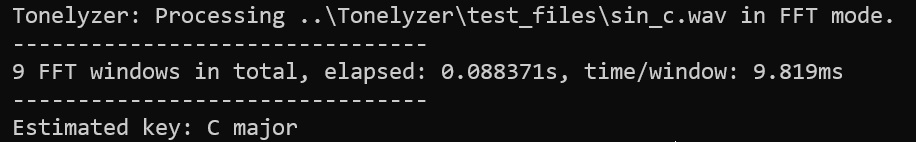

# ToneLyzer

**Author:** Péter Sasvári  

## Overview

**ToneLyzer** is a spectrum analysis tool that determines the musical key of an audio file.  
It supports both **Fast Fourier Transform (FFT)** and the slower **Discrete Fourier Transform (DFT)** for frequency analysis.



## Features

- Performs frequency analysis using FFT (default) or DFT (`-dft` flag).
- Builds a pitch-class histogram from dominant frequencies.  
- Matches the histogram against **Krumhansl–Kessler key profiles**.  
- Identifies the most likely key via **Pearson correlation**.  

## Usage

```bash
<executable_name> <input_file> [-dft] [-f=440] [-w=4096]
```
-f flag is the frequency of the standard A center pitch.
-w is the window size of the FFT which must be a power of two.
 
